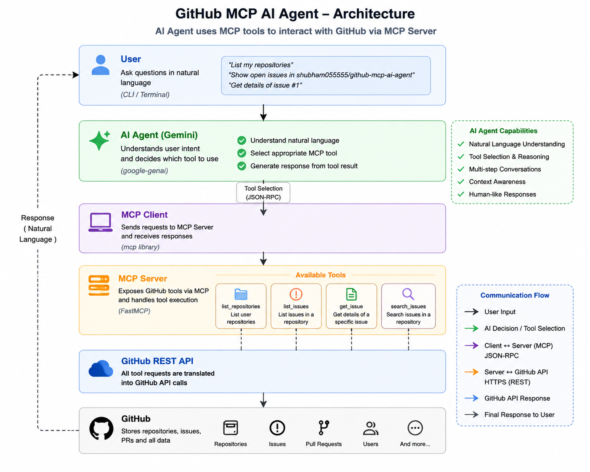

# GitHub MCP AI Agent

An AI-powered GitHub assistant built with Python, Model Context Protocol (MCP), GitHub REST API, and Google Gemini.

This project demonstrates how an AI agent can interact with GitHub repositories and issues through MCP tools. The AI model does not directly access the GitHub API. Instead, GitHub operations are exposed through an MCP server and accessed by the AI agent through an MCP client.

## Overview

The system provides an AI-driven interface for performing GitHub operations such as:

* Listing repositories
* Listing repository issues
* Filtering issues by state
* Searching issues
* Retrieving individual issues
* Executing multi-step tool workflows

The project also includes a deterministic local evaluation system for testing MCP tools without consuming AI API quota.

## Architecture

The GitHub MCP AI Agent follows a layered architecture where the AI agent uses MCP tools to interact with GitHub through a dedicated MCP server.




```text
                         User
                          |
                          v
                 +-------------------+
                 |   Gemini AI Agent  |
                 |    ai_client.py   |
                 +---------+---------+
                           |
                           v
                 +-------------------+
                 |     MCP Client    |
                 |     client.py     |
                 +---------+---------+
                           |
                     STDIO Transport
                           |
                           v
                 +-------------------+
                 |     MCP Server    |
                 |     server.py     |
                 +---------+---------+
                           |
                           v
                 +-------------------+
                 |  GitHub REST API  |
                 +-------------------+
```

## Technology Stack

| Technology             | Purpose                         |
| ---------------------- | ------------------------------- |
| Python 3.11            | Application development         |
| Model Context Protocol | Tool communication layer        |
| MCP Python SDK         | MCP server and client           |
| GitHub REST API        | GitHub data and operations      |
| Google Gemini          | AI agent and tool selection     |
| python-dotenv          | Environment variable management |
| requests               | HTTP requests to GitHub         |
| MCP Inspector          | MCP server testing              |

## MCP Tools

The MCP server currently exposes four tools.

### `list_repositories`

Lists repositories associated with the authenticated GitHub account.

### `list_issues`

Lists issues from a GitHub repository.

Supported issue states:

```text
open
closed
all
```

Example:

```text
list_issues(
    owner="shubham055555",
    repo="QueryMind",
    state="open"
)
```

### `get_issue`

Retrieves information about a specific issue using the issue number.

Example:

```text
get_issue(
    owner="shubham055555",
    repo="QueryMind",
    issue_number=1
)
```

### `search_issues`

Searches issues within a repository using a query.

Example queries:

```text
bug
authentication
API
security
database
login
```

## Project Structure

```text
github-mcp-server/
|
+-- .gitignore
+-- README.md
+-- requirements.txt
|
+-- github_client.py
+-- server.py
+-- client.py
+-- ai_client.py
+-- evaluation.py
|
+-- evaluation_results/
    +-- local_evaluation_YYYYMMDD_HHMMSS.json
```

## File Description

| File               | Description                                                   |
| ------------------ | ------------------------------------------------------------- |
| `github_client.py` | GitHub REST API client and authentication                     |
| `server.py`        | MCP server containing GitHub tools                            |
| `client.py`        | MCP client for communicating with the server                  |
| `ai_client.py`     | Gemini-based AI agent                                         |
| `evaluation.py`    | Deterministic local MCP evaluation                            |
| `.env`             | Local API credentials                                         |
| `.gitignore`       | Prevents sensitive and unnecessary files from being committed |
| `requirements.txt` | Python dependencies                                           |

## Requirements

Before running the project, install:

* Python 3.11 or later
* Git
* GitHub account
* GitHub Personal Access Token
* Google Gemini API key

## Installation

Clone the repository:

```bash
git clone <YOUR_REPOSITORY_URL>
cd github-mcp-ai-agent
```

Create a virtual environment:

```bash
python -m venv .venv
```

Activate the environment on Windows:

```cmd
.venv\Scripts\activate
```

Install dependencies:

```bash
pip install -r requirements.txt
```

## Configuration

Create a `.env` file in the project root:

```env
GITHUB_TOKEN=your_github_token
GEMINI_API_KEY=your_gemini_api_key
```

Do not commit the `.env` file to GitHub.

The `.gitignore` file excludes:

```text
.env
.venv/
__pycache__/
evaluation_results/
```

## Running the MCP Server

Check the server for syntax errors:

```cmd
python -m py_compile server.py
```

Run the MCP server:

```cmd
python server.py
```

The MCP server uses STDIO transport for communication with MCP clients.

## Running the MCP Client

Run:

```cmd
python client.py
```

The client starts the MCP server and communicates with it using the MCP protocol.

## Running the AI Agent

Run:

```cmd
python ai_client.py
```

Example user query:

```text
Show me all open issues in QueryMind.
```

The AI agent determines the appropriate MCP tool, generates the required arguments, executes the tool through the MCP client, and uses the result to generate the final response.

## Agent Workflow

For example, when the user asks:

```text
Show me all open issues in QueryMind.
```

The workflow is:

```text
User Query
    |
    v
Gemini AI Agent
    |
    v
Tool Selection
    |
    v
list_issues
    |
    v
MCP Client
    |
    v
MCP Server
    |
    v
GitHub REST API
    |
    v
GitHub Response
    |
    v
MCP Client
    |
    v
Gemini AI Agent
    |
    v
Final Response
```

## MCP Inspector

The MCP server can also be tested using MCP Inspector.

The available tools can be inspected and executed independently:

```text
list_repositories
list_issues
get_issue
search_issues
```

This makes it possible to verify the MCP server before connecting it to the AI agent.

## Evaluation

The project includes a deterministic local evaluation system.

Run:

```cmd
python -m py_compile evaluation.py
python evaluation.py
```

The evaluation does not use Gemini API calls. This makes the MCP evaluation reproducible and avoids AI API rate limits.

The evaluation checks:

* MCP tool availability
* Tool execution
* Expected arguments
* Repository operations
* Issue listing
* Issue searching
* Individual issue retrieval
* Multi-step scenarios

## Evaluation Results

The current evaluation contains 20 test cases.

```text
Total Tests              : 20
Completed Tests          : 20
Passed Tests             : 20
Failed Tests             : 0
Execution Errors         : 0

Tool Accuracy            : 100.00%
Argument Accuracy        : 100.00%
Tool Execution Success   : 100.00%
```

Result:

```text
All 20 tests passed successfully.
```

Evaluation results are automatically saved in:

```text
evaluation_results/
```

## Testing Strategy

The project separates MCP infrastructure testing from AI model evaluation.

### MCP Evaluation

The deterministic evaluation tests whether the MCP server:

* exposes the expected tools
* accepts the expected arguments
* successfully executes GitHub operations
* returns responses without execution errors

### AI Agent

The Gemini agent is responsible for:

* understanding natural language queries
* selecting an appropriate MCP tool
* generating tool arguments
* executing tools through MCP
* handling multi-step workflows
* generating a final natural language response

This separation allows the MCP infrastructure to be tested without depending on Gemini API availability or request quotas.

## Example Queries

The AI agent can handle queries such as:

```text
Show me all my repositories.
```

```text
Show me the open issues in QueryMind.
```

```text
Find bug-related issues in QueryMind.
```

```text
Search for security issues in QueryMind.
```

```text
Get issue number 1 from QueryMind.
```

## Why Model Context Protocol?

Model Context Protocol provides a standardized interface between AI applications and external tools and data sources.

In this project, GitHub functionality is exposed as MCP tools.

This architecture provides separation between:

```text
AI Layer
MCP Layer
GitHub Integration Layer
```

As a result, the GitHub tools can potentially be reused by different MCP-compatible AI applications.

## Security

API credentials are stored locally in `.env`.

Sensitive files are excluded from version control using `.gitignore`.

Never commit the following files:

```text
.env
```

Never expose GitHub or Gemini API keys in source code, README files, screenshots, or public repositories.

## Future Improvements

Possible future improvements include:

* Creating GitHub issues through MCP
* Updating existing issues
* Closing issues
* Creating pull requests
* Searching repositories
* Repository activity analysis
* GitHub Actions CI/CD
* Advanced AI agent evaluation
* Persistent conversation memory
* Web-based user interface
* Structured logging
* Error handling and retry mechanisms
* Support for additional GitHub operations

## Current Status

```text
GitHub REST API Integration     Completed
MCP Server                      Completed
MCP Client                      Completed
Gemini AI Agent                 Completed
MCP Inspector Testing           Completed
Multi-step Tool Calling         Completed
Local Deterministic Evaluation  Completed
20/20 Tests Passed              Completed
Project Documentation           Completed
```

## License

This project is intended for learning, experimentation, and open-source development.

## Demo

The agent can understand natural-language GitHub requests and automatically select and execute the appropriate MCP tool.

### Example 1: List Open Issues

User request:

```text
Show me all open issues in QueryMind